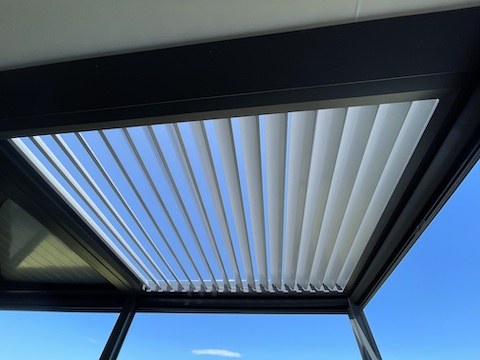
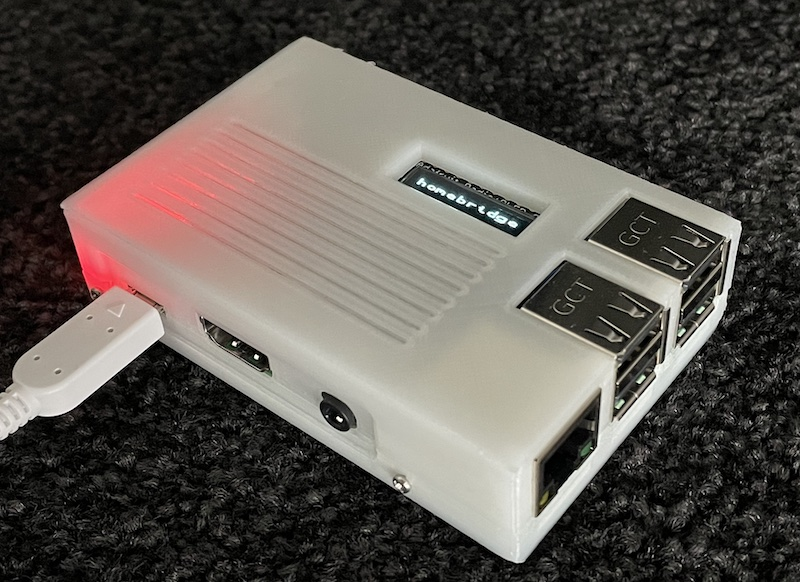
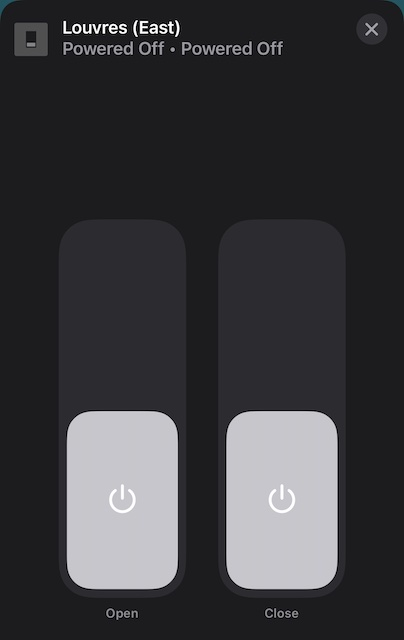

# RFM69HCW Homebridge Plugin

|||
|-|-|
|||

A [Homebridge](https://homebridge.io/) plugin for Adafruit's Raspberry Pi [RFM69HCW Transceiver Radio Bonnet](https://www.adafruit.com/product/4073).

Enabling HomeKit control of 433MHz devices such as Louvres and outside lighting.

## Prerequisites

1. Raspberry Pi (deployed on a 3, 4+ should work?)
2. Adafruit's Raspberry Pi [RFM69HCW Transceiver Radio Bonnet](https://www.adafruit.com/product/4073)

## Installing

1. Search plugins for `homebridge-rfm69hcw` and install
2. Add accessories
   1. Fill in name
   2. Select device type
   3. Enter in transmission code (see determining codes)
   4. Optionally set transmission times
3. Restart Homebridge

Transmission time is how long the "button" is being held down for. In the case of louvres this defaults to 40, which is ~4 seconds. Depending on your configuration you may want this to be longer/shorter. Ideally it should be set so that from close the louvers completely open.

## Supported devices

* Roof louvres at 433MHz based on the EV1527 chip
* Lighting strip from an unknown manufacturer

### EV1527 Louvres

Exposed as two switches:



Enabling a switch will continually transmit that action for the configured number of times. Once the configured times has been hit, this plugin will revert the state of the switch back to off. Can also interrupt a transmission by either toggling that action back to off, or toggling of the alternative action. For instance turning on open will begin opening the louvres, and the manually turn open to off will stop the transmission before the regular timeout.

### Lightstrip

Exposed as a lightbulb. Hold on the button to access the dimming control.

## Development

### Close this repo

```sh
git clone ...
cd homebridge-rfm69hcw
```

### Local width homebridge development

```sh
# run from cloned repo
# this will monitor for changes and start homebridge in dev mode
npm run watch
```

### Local standalone development

```sh
# run from cloned repo
# this will run src/_dev/index.ts which allows for direct instantiation of modules
npm start
```

### Determining codes

Stop homebridge

```sh
sudo systemctl stop homebridge
```

Navigate to homebridge-rfm69hcw's module directory, install dev dependencies, and then run:

```sh
cd /usr/local/lib/node_modules/homebridge-rfm69hcw
npm install
npm start
```

Select desired device:

```
1 EV1527
2 LIGHTSTRIP
Device type? 1
Listening for Ev1527 packets
```

Pressing a button on the corresponding remote should now output the appropriate code for that button.
